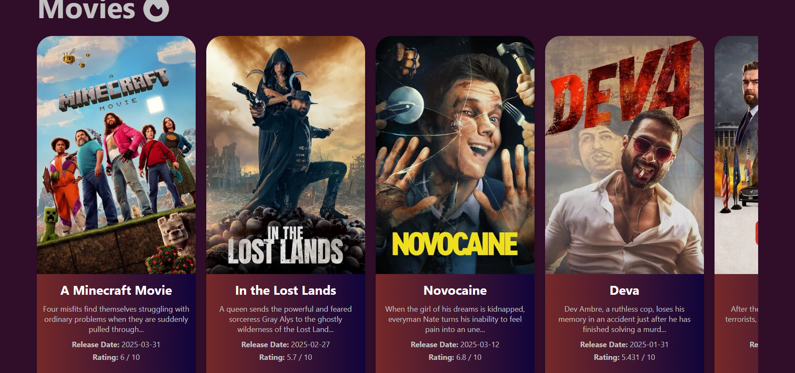
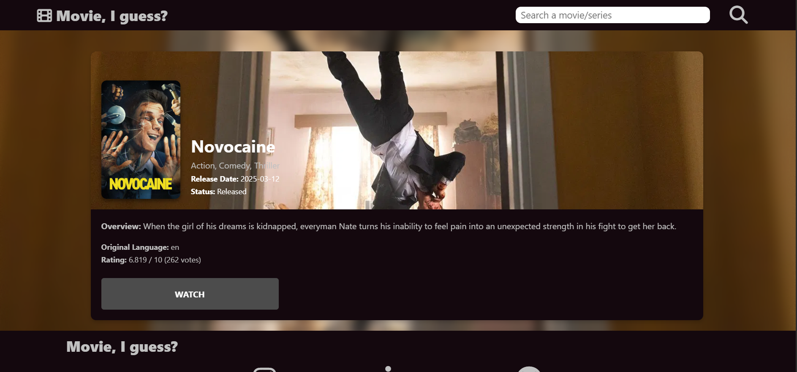
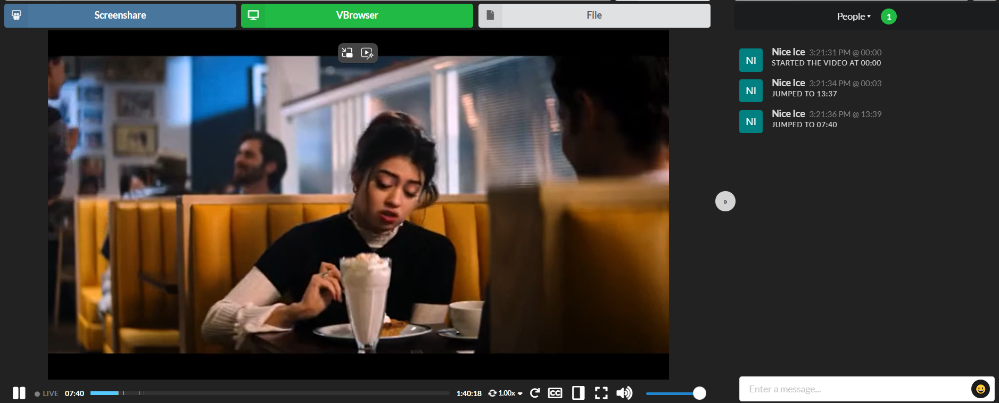

# 🎬 MLTN VAULT // movieIguess
> *"Rise from the shadows and command your entertainment."*

Welcome to **movieIguess** (MLTN VAULT), the ultimate streaming frontend for movies, anime, and TV shows. Discover trending titles, enjoy ad-free embedded streaming, and host synchronized watch parties with your squad—all powered by a fast, responsive interface.

👉 **[Live Demo](https://xtian69420.github.io/movieIguess/)**

---

## ⚡ Features

* 🔍 **Search & Discover**: Instantly query thousands of movies and shows integrated via TMDB API.
* 📺 **Ad-Filtered Embedded Player**: Stream your favorite content directly through streamlined video proxies.
* 👯 **Shadow Watch Party**: Sync playback controls in real-time with friends and chat while watching.
* 📱 **Fluid Responsive UI**: Fully optimized for mobile, tablet, and desktop viewports.
* 💥 **Dynamic Anime Animations**: Custom interactive intro transitions and sleek UI glow effects.

---

## 📸 Screenshots

### 🏠 Homepage


---

### 🍿 Movie & Show Details


---

### ⚔️ Watch Party Mode


---

## 🛠️ Tech Stack

* **Frontend**: HTML5, Tailwind CSS, JavaScript (ES6+)
* **API Integration**: TMDB (The Movie Database)
* **Hosting**: GitHub Pages / Vercel
* **Icons & Assets**: Custom SVG & Canvas effects

---

## 🔮 Future Roadmap

- [ ] **Next-Gen UI Upgrade**: Darker theme variants and full particle background integration.
- [ ] **Live Search Suggestions**: Real-time autocomplete and genre filters.
- [ ] **User Account System**: Saved watchlists, watch history, and personalized recommendations.
- [ ] **Expanded Watch Party Controls**: Host permissions and room passcode protection.

---

## 🚀 Quick Start (Local Development)

1. **Clone the repository:**
   ```bash
   git clone [https://github.com/xtian69420/movieIguess.git](https://github.com/xtian69420/movieIguess.git)
   cd movieIguess